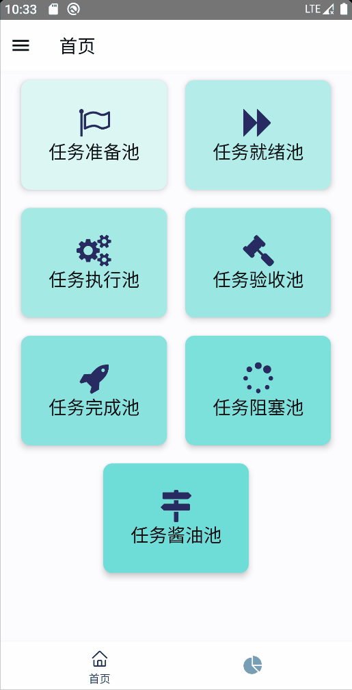
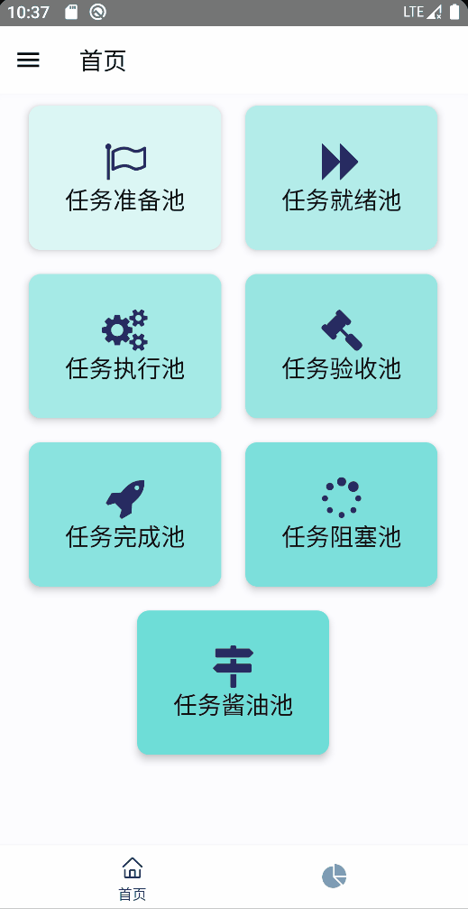
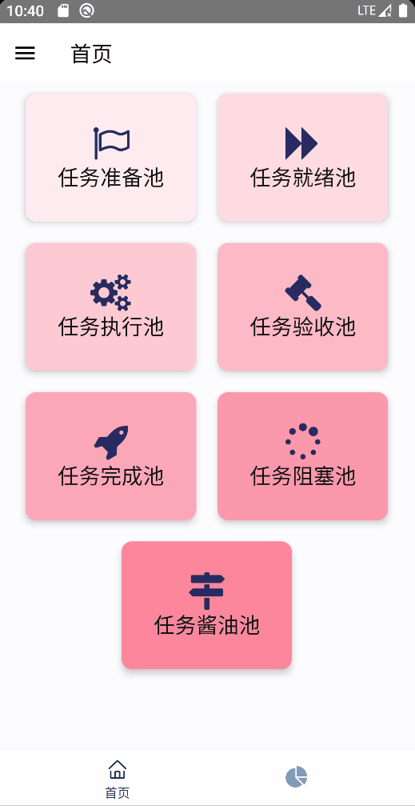

# README
 Inspired by [this video](https://www.bilibili.com/video/BV1x44y1x7b7?from=search&seid=3052411042992310660&spm_id_from=333.337.0.0).

### Introduction

Task Pool is a to-do-app like application intended to help build forward workflow in daily life base on the idea of [Getting Things Done](https://en.wikipedia.org/wiki/Getting_Things_Done). This app divides all tasks into 7 parts judging from their importance and urgency: 

- Plans: anything that has a chance to be done
- Ready to do: things that should be done during a specific period (for example 1 day)
- Doing now: current action
- Finished Tasks
- Tasks that need to be further summarized
- Long-term tasks
- Leisure tasks

And by adding tasks into different pool and organizing daily tasks one may have a better perspective on life with "mind like water".

This app is built with React Native and it is a personal practice work for learning RN. It only supports Android at present.

### PREVIEW

|                  Add / Delete / Update                  |                 Archive / Statistics                 |                   Theme / Layout                   |
| :-----------------------------------------------------: | :--------------------------------------------------: | :------------------------------------------------: |
|  |  |  |

